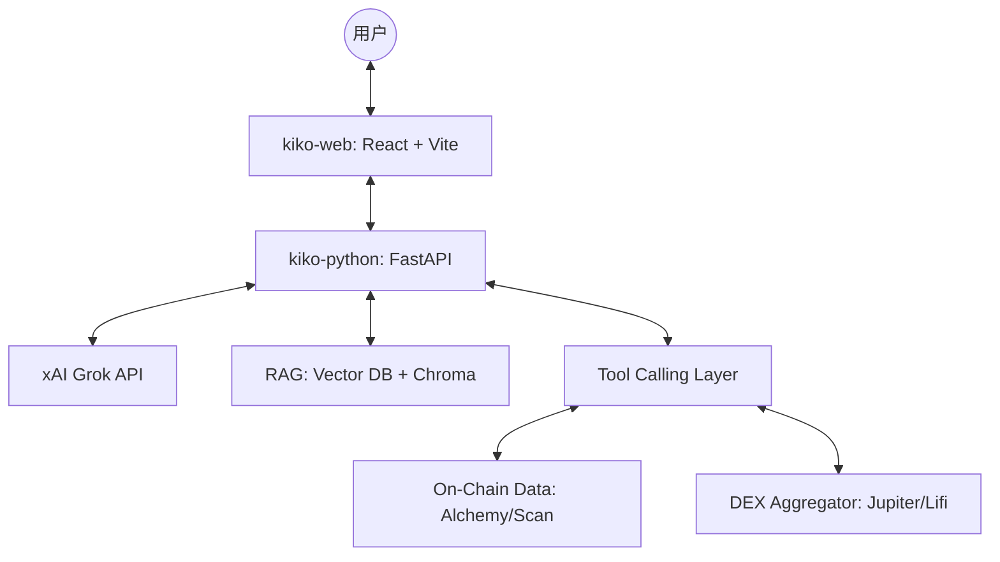

# 核心架构

KiKo 采用了现代化的三层架构体系，确保了高并发下的响应速度与 AI 推理的准确性。

## 系统全景图

## 核心组件说明

### 1. kiko-web (前端)
- **技术栈**: React.js, TypeScript, TailwindCSS.
- **认证**: 使用 Privy 进行钱包连接与 JWT 获取。
- **状态管理**: 深度集成 React Hooks，实现交易状态的实时监听与卡片式交互。

### 2. kiko-python (AI 路由器)
- **框架**: FastAPI.
- **职能**: 它是连接前端与大模型的“脑干”。负责：
    - 鉴权校验 (Verification of Privy tokens).
    - 意图路由 (Intent Routing).
    - 工具执行 (Tool Execution).

### 3. xAI Grok (大语言模型)
KiKo 默认使用 Grok 驱动。相比传统模型，Grok 在处理 Web3 术语、Twitter/X 上的实时舆情数据方面具有天然优势。

### 4. 工具链 (Tools Framework)
这是 KiKo 的灵魂。我们通过严格定义的 JSON Schema，让 AI 能够调用：
- `check_token_risk`: 合约安全扫描。
- `prepare_swap_transaction`: 构造链上交易。
- `fetch_farcaster_trending`: 获取社交热度。

### 5. RAG (知识库)
为了保持 AI 对最新 Web3 协议的认知，我们构建了一个基于 ChromaDB 的 RAG 系统。AI 会在回答复杂技术问题前，先从本地知识库中检索相关的 API 文档或协议原理。
